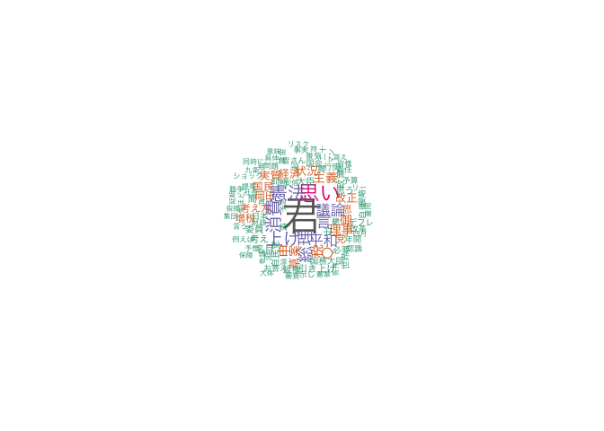

# kaigiroku: Programmatic Access to the API for Japanese Diet Proceedings

This package is to access the API of Kokkai Kaigiroku, conference
minutes of Japanese National Diet. The API documentation is available
[here](http://kokkai.ndl.go.jp/api.html) (only in Japanese).

### Prerequisites

Nothing. You may need to download dependent packages during the
installation.

### Installation

You can isntall the package from CRAN:

``` r
install.packages("kaigiroku")
```

Alternativeky, you can install a developer version by:

``` r
devtools::install_github("amatsuo/kaigiroku")
```

## Examples

At the moment, the package provide only the functionality to download
conference minutes of specific meetings (e.g. Budget Committee
(予算委員会) and Plenary Meeting (本会議)) for a specified period.

### Download Conference Minutes

``` r
require(kaigiroku)
#> Loading required package: kaigiroku
# the following line will download all speeches at plenary meetings in the 
# Upper House (参議院) from Jan 1 to Jan 31, 2017. 
plenary_speeches <- get_meeting(house = "Upper", startDate = "2017-01-01", 
                                endDate = "2017-01-31", meetingName = "本会議")
#> 4 records found
#> Fetching (current_record_position: 1)
#> Fetching (current_record_position: 4)

# the following line will download all speeches at the budget committee meetings in 
# the lower house during the 185th session.
budgetcom_speeches <- get_meeting(house = "Lower", sessionNumber = 185, 
                                  meetingName = "予算委員会")
#> 4 records found
#> Fetching (current_record_position: 1)
#> Fetching (current_record_position: 4)

# the following line will download all speeches at the budget committee meetings in 
# the Prime Minister's Questions (or Party Leader Debate, "国家基本政策委員会合同審査会")
# qt_speeches are used in the later part of demos
qt_speeches <- get_meeting(house = "Both", sessionNumber = 190, 
                           meetingName = "国家基本政策委員会合同審査会")
#> 1 records found
#> Fetching (current_record_position: 1)
head(qt_speeches)
#> # A tibble: 6 × 23
#>   issueID   imageKind searchObject session nameOfHouse nameOfMeeting issue date 
#>   <chr>     <chr>            <int>   <int> <chr>       <chr>         <chr> <chr>
#> 1 11902429… 会議録               0     190 両院        国家基本政策… 第1号 2016…
#> 2 11902429… 会議録               0     190 両院        国家基本政策… 第1号 2016…
#> 3 11902429… 会議録               0     190 両院        国家基本政策… 第1号 2016…
#> 4 11902429… 会議録               0     190 両院        国家基本政策… 第1号 2016…
#> 5 11902429… 会議録               0     190 両院        国家基本政策… 第1号 2016…
#> 6 11902429… 会議録               0     190 両院        国家基本政策… 第1号 2016…
#> # … with 15 more variables: closing <lgl>, speechID <chr>, speechOrder <int>,
#> #   speaker <chr>, speakerYomi <chr>, speakerGroup <chr>,
#> #   speakerPosition <chr>, speakerRole <lgl>, speech <chr>, startPage <int>,
#> #   createTime <chr>, updateTime <chr>, speechURL <chr>, meetingURL <chr>,
#> #   pdfURL <chr>
```

### After getting speeches

Using the power of `quanteda` (and `stringi` for boundary split), you
can easily work with the texts and run analyses.

First, we need to remove unnecessary text sections unique to Japanese
conforence minutes.

``` r
require(quanteda)
#> Loading required package: quanteda
#> Package version: 3.0.0
#> Unicode version: 13.0
#> ICU version: 67.1
#> Parallel computing: 8 of 8 threads used.
#> See https://quanteda.io for tutorials and examples.
require(stringi)
#> Loading required package: stringi
require(dplyr)
#> Loading required package: dplyr
#> 
#> Attaching package: 'dplyr'
#> The following objects are masked from 'package:stats':
#> 
#>     filter, lag
#> The following objects are masked from 'package:base':
#> 
#>     intersect, setdiff, setequal, union

# delete header
qt_speeches <- qt_speeches[qt_speeches$speaker !="", ]
# delete speeches by the chair of the meeting
qt_speeches <- qt_speeches[grep("^○会長", qt_speeches$speech, invert = TRUE), ]

# revmove non-speech part
qt_speeches$speech <- stri_replace_all_regex(qt_speeches$speech, "^○\\S+\\s+", "")
qt_speeches$speech <- stri_replace_all_regex(qt_speeches$speech, "（.+?）|〔.+?〕", "")
qt_speeches$speech <- stri_replace_all_regex(qt_speeches$speech, "^\\s{2,}.+\n", "")
```

Now, generate corpus and then tokens object.

``` r
# generate quanteda corpus object
data_corpus_qtspeech <- corpus(qt_speeches$speech, 
                               docnames = paste(qt_speeches$speaker, qt_speeches$speechOrder),
                               docvars = qt_speeches[, c(1:5, 8:9)])
summary(data_corpus_qtspeech)
#> Corpus consisting of 41 documents, showing 41 documents:
#> 
#>           Text Types Tokens Sentences               issueID imageKind
#>   会議録情報 0   225    540         1 119024293X00120160518    会議録
#>     岡田克也 2   118    237        10 119024293X00120160518    会議録
#>     安倍晋三 3   190    437         7 119024293X00120160518    会議録
#>     岡田克也 4   194    461        14 119024293X00120160518    会議録
#>     安倍晋三 5   154    393        12 119024293X00120160518    会議録
#>     岡田克也 6   170    465        15 119024293X00120160518    会議録
#>     安倍晋三 7   180    451        13 119024293X00120160518    会議録
#>     岡田克也 8   121    261         8 119024293X00120160518    会議録
#>     安倍晋三 9   139    328         7 119024293X00120160518    会議録
#>    岡田克也 10   264    658        24 119024293X00120160518    会議録
#>    岡田克也 12    53     67         3 119024293X00120160518    会議録
#>    安倍晋三 13   112    257         5 119024293X00120160518    会議録
#>    岡田克也 14    66    119         4 119024293X00120160518    会議録
#>    安倍晋三 15   111    240         6 119024293X00120160518    会議録
#>    岡田克也 16   102    208         8 119024293X00120160518    会議録
#>    安倍晋三 17   151    471        13 119024293X00120160518    会議録
#>    安倍晋三 19   122    248         6 119024293X00120160518    会議録
#>    安倍晋三 21    21     23         1 119024293X00120160518    会議録
#>    岡田克也 22   146    284        17 119024293X00120160518    会議録
#>    安倍晋三 23   168    447        16 119024293X00120160518    会議録
#>    安倍晋三 25    18     20         2 119024293X00120160518    会議録
#>    安倍晋三 27    59     70         3 119024293X00120160518    会議録
#>    岡田克也 28   192    485        24 119024293X00120160518    会議録
#>    安倍晋三 29   151    340        12 119024293X00120160518    会議録
#>    安倍晋三 31    26     28         1 119024293X00120160518    会議録
#>    岡田克也 33     6      6         1 119024293X00120160518    会議録
#>    岡田克也 35    65    100         5 119024293X00120160518    会議録
#>    岡田克也 37    50     68         4 119024293X00120160518    会議録
#>    志位和夫 39   116    240         8 119024293X00120160518    会議録
#>    安倍晋三 40   130    297         5 119024293X00120160518    会議録
#>    志位和夫 41   173    391        13 119024293X00120160518    会議録
#>    安倍晋三 42   167    477         9 119024293X00120160518    会議録
#>    安倍晋三 44    13     13         1 119024293X00120160518    会議録
#>    志位和夫 45    48     73         5 119024293X00120160518    会議録
#>    安倍晋三 47    68    112         2 119024293X00120160518    会議録
#>    安倍晋三 49    12     12         1 119024293X00120160518    会議録
#>    志位和夫 50     9     10         1 119024293X00120160518    会議録
#>    志位和夫 52    76    116         3 119024293X00120160518    会議録
#>  片山虎之助 54   326    899        51 119024293X00120160518    会議録
#>    安倍晋三 56   170    455        10 119024293X00120160518    会議録
#>  片山虎之助 58    14     19         2 119024293X00120160518    会議録
#>  searchObject session nameOfHouse       date closing
#>             0     190        両院 2016-05-18      NA
#>             0     190        両院 2016-05-18      NA
#>             0     190        両院 2016-05-18      NA
#>             0     190        両院 2016-05-18      NA
#>             0     190        両院 2016-05-18      NA
#>             0     190        両院 2016-05-18      NA
#>             0     190        両院 2016-05-18      NA
#>             0     190        両院 2016-05-18      NA
#>             0     190        両院 2016-05-18      NA
#>             0     190        両院 2016-05-18      NA
#>             0     190        両院 2016-05-18      NA
#>             0     190        両院 2016-05-18      NA
#>             0     190        両院 2016-05-18      NA
#>             0     190        両院 2016-05-18      NA
#>             0     190        両院 2016-05-18      NA
#>             0     190        両院 2016-05-18      NA
#>             0     190        両院 2016-05-18      NA
#>             0     190        両院 2016-05-18      NA
#>             0     190        両院 2016-05-18      NA
#>             0     190        両院 2016-05-18      NA
#>             0     190        両院 2016-05-18      NA
#>             0     190        両院 2016-05-18      NA
#>             0     190        両院 2016-05-18      NA
#>             0     190        両院 2016-05-18      NA
#>             0     190        両院 2016-05-18      NA
#>             0     190        両院 2016-05-18      NA
#>             0     190        両院 2016-05-18      NA
#>             0     190        両院 2016-05-18      NA
#>             0     190        両院 2016-05-18      NA
#>             0     190        両院 2016-05-18      NA
#>             0     190        両院 2016-05-18      NA
#>             0     190        両院 2016-05-18      NA
#>             0     190        両院 2016-05-18      NA
#>             0     190        両院 2016-05-18      NA
#>             0     190        両院 2016-05-18      NA
#>             0     190        両院 2016-05-18      NA
#>             0     190        両院 2016-05-18      NA
#>             0     190        両院 2016-05-18      NA
#>             0     190        両院 2016-05-18      NA
#>             0     190        両院 2016-05-18      NA
#>             0     190        両院 2016-05-18      NA

data_tokens_qtspeech <- tokens(data_corpus_qtspeech)

# kwicly look at some key terms
kwic(data_tokens_qtspeech, "政府", window = 4) # government 
#> Keyword-in-context with 4 matches.                                                                     
#>  [会議録情報 0, 494]       世 耕 弘 成君 | 政府 | 特別 補佐 人 横    
#>    [安倍晋三 3, 267] なりわい の 再建 に | 政府 | 一丸 と な って    
#>    [岡田克也 6, 100]     一月 時点 で の | 政府 | 見通し は、 実質   
#>    [岡田克也 6, 192]   つまり 半年 前 の | 政府 | の 見通し を かなり
kwic(data_tokens_qtspeech, "経済", window = 4) # ecnomy
#> Keyword-in-context with 19 matches.                                                                           
#>  [会議録情報 0, 427]       大臣 森山 裕 君 | 経済 | 産業 大臣 国務大臣 林  
#>    [岡田克也 4, 216]      で、 必ずや その | 経済 | 状況 を つくり出す こと
#>    [岡田克也 4, 236]         ね。 そして、 | 経済 | 判断 条項 も 削除      
#>    [岡田克也 4, 287]        た わけ です。 | 経済 | の 現状 は どうか      
#>    [岡田克也 4, 412] やはり この 一年半 の | 経済 | 運営 が うまく いか    
#>    [安倍晋三 5, 106]        から、 我々 の | 経済 | 政策 は 功 を          
#>      [岡田克也 6, 9]         の やら れ た | 経済 | 政策 を 全 否定        
#>    [岡田克也 6, 273]          私 は、 この | 経済 | 運営、 あれだけ、      
#>    [安倍晋三 7, 112]      。 そこで、 世界 | 経済 | の 状況 で あり        
#>    [安倍晋三 7, 120]      あり ます。 世界 | 経済 | の 状況 について 言    
#>    [安倍晋三 7, 226]    において、 中国 の | 経済 | の 減速 という リスク  
#>    [安倍晋三 7, 376]   あした も 国際 金融 | 経済 | 分析 会合 を 開        
#>     [岡田克也 8, 10]          た、 中国 の | 経済 | が どう なる か        
#>     [安倍晋三 9, 11]        ます よう に、 | 経済 | という の は 生き物    
#>    [安倍晋三 9, 252]      、 そして また、 | 経済 | の 状況 について の    
#>   [岡田克也 10, 220]       い ます よう な | 経済 | 状況、 特に 消費       
#>   [安倍晋三 13, 121]    思い ます。 いわば | 経済 | を しっかり と 成長    
#>    [志位和夫 39, 36]        て 以来、 日本 | 経済 | の 六 割 を            
#>   [志位和夫 41, 148]       、 この よう な | 経済 | 情勢 の も と
kwic(data_tokens_qtspeech, "成長", window = 4) # growth
#> Keyword-in-context with 3 matches.                                                                 
#>    [安倍晋三 5, 25]          ・ 七％ の | 成長 | で ご ざ いま   
#>    [安倍晋三 5, 88]          ・ 四％ の | 成長 | で あり まして、
#>  [安倍晋三 13, 125] 経済 を しっかり と | 成長 | さ せ てい かな
```

``` r
require(readtext)
#> Loading required package: readtext
# generate tokens and then dfm 
data_dfm_qtspeech <- tokens(data_corpus_qtspeech, remove_punct = TRUE) %>% dfm()
#topfeatures(data_dfm_qtspeech, n = 100)

# remove stopwords and punctuations (using slothlib list http://www.dl.kuis.kyoto-u.ac.jp/slothlib/)
# Warning: the word list removes potentially important words
jpstopwords <- readtext("http://svn.sourceforge.jp/svnroot/slothlib/CSharp/Version1/SlothLib/NLP/Filter/StopWord/word/Japanese.txt")
jpstopwords <- tokens(jpstopwords[jpstopwords != ""]) %>% as.character
# remove stopwords
data_dfm_qtspeech <- dfm_remove(data_dfm_qtspeech, 
                                valuetype = "fixed",
                                pattern = jpstopwords)

topfeatures(data_dfm_qtspeech, n = 20) # still a lot of unnecessary features
#>       は       を     ます       て       し   という       君       い 
#>      355      266      208      151      127      119      117      108 
#>     ない     って     です     いる       た     あり     した       れ 
#>      105       90       76       75       75       67       66       62 
#>     てい     思い において     その 
#>       62       54       51       48

# remove entries only with hiraganas (ひらがな)
data_dfm_qtspeech <- dfm_remove(data_dfm_qtspeech, 
                                pattern = "^[あ-ん]+$",
                                valuetype = "regex")
print(data_dfm_qtspeech)
#> Document-feature matrix of: 41 documents, 1,055 features (95.34% sparse) and 7 docvars.
#>               features
#> docs           平成 二十 八年 五月 十八日 午後 開議 委員 氏名 衆議
#>   会議録情報 0    1    1    1    1      1    1    1    4    1    3
#>   岡田克也 2      0    0    0    0      0    0    0    0    0    0
#>   安倍晋三 3      0    0    0    0      0    0    0    0    0    0
#>   岡田克也 4      0    0    0    0      0    0    0    0    0    1
#>   安倍晋三 5      0    1    0    0      0    0    0    0    0    0
#>   岡田克也 6      0    2    0    0      0    0    0    0    0    0
#> [ reached max_ndoc ... 35 more documents, reached max_nfeat ... 1,045 more features ]
topfeatures(data_dfm_qtspeech, n = 20) #looks better
#>   君 思い 憲法 消費 上げ 総理   言 議論 平和   申   税 理事   御   〇 主義 草案 
#>  117   54   43   41   40   39   34   31   31   28   27   24   24   24   24   22 
#> 状況 経済 実質 改正 
#>   21   19   19   19

quanteda.textplots::textplot_wordcloud(
  data_dfm_qtspeech, min_count = 6, random_order = FALSE,
  rotation = .25, 
  family = "HiraKakuProN-W3", # or other fonts 
  color = RColorBrewer::brewer.pal(8,"Dark2"))
```

<!-- -->

## Topicmodeling

We are going to esitmate an LDA topic model. First regenerate dfm at
sentence level

``` r
data_corpus_qtspeech_sent <- corpus_reshape(data_corpus_qtspeech, to = "sentences")
data_dfm_qtspeech_sent <- data_corpus_qtspeech_sent %>% tokens(remove_punct = TRUE) %>% dfm
data_dfm_qtspeech_sent <- dfm_remove(data_dfm_qtspeech_sent, 
                                     valuetype = "fixed",
                                     pattern = jpstopwords)

# remove entries only with hiraganas (ひらがな)
data_dfm_qtspeech_sent <- dfm_remove(data_dfm_qtspeech_sent, 
                                     pattern = "^[あ-ん]+$",
                                     valuetype = "regex")
```

Run the model

``` r
require(topicmodels)
#> Loading required package: topicmodels

model_lda_qt_speeches <- LDA(convert(data_dfm_qtspeech_sent, to = "topicmodels"), 
                             k = 6)
get_terms(model_lda_qt_speeches, 10)
#>       Topic 1    Topic 2 Topic 3  Topic 4 Topic 5  Topic 6   
#>  [1,] "消費"     "憲法"  "平和"   "上げ"  "名目"   "君"      
#>  [2,] "税"       "議論"  "主義"   "申"    "実質"   "理事"    
#>  [3,] "増税"     "改正"  "貫"     "思い"  "思い"   "大臣"    
#>  [4,] "〇"       "草案"  "御"     "状況"  "〇"     "委員"    
#>  [5,] "引き上げ" "自衛"  "思い"   "経済"  "デフレ" "国務大臣"
#>  [6,] "判断"     "聞"    "岡田"   "総理"  "改革"   "院"      
#>  [7,] "賃金"     "行使"  "侵略"   "言"    "財政"   "参議"    
#>  [8,] "総理"     "示し"  "言"     "政権"  "例えば" "岡田"    
#>  [9,] "景気"     "思う"  "考え方" "政策"  "方々"   "衆議"    
#> [10,] "事実"     "権"    "党"     "認識"  "数字"   "委員長"
# topics(model_lda_qt_speeches, 3)
```

## Comments and feedback

I welcome your comments and feedback. Please file issues on the issues
page, and/or send me comments at <A.Matsuo@lse.ac.uk>.
